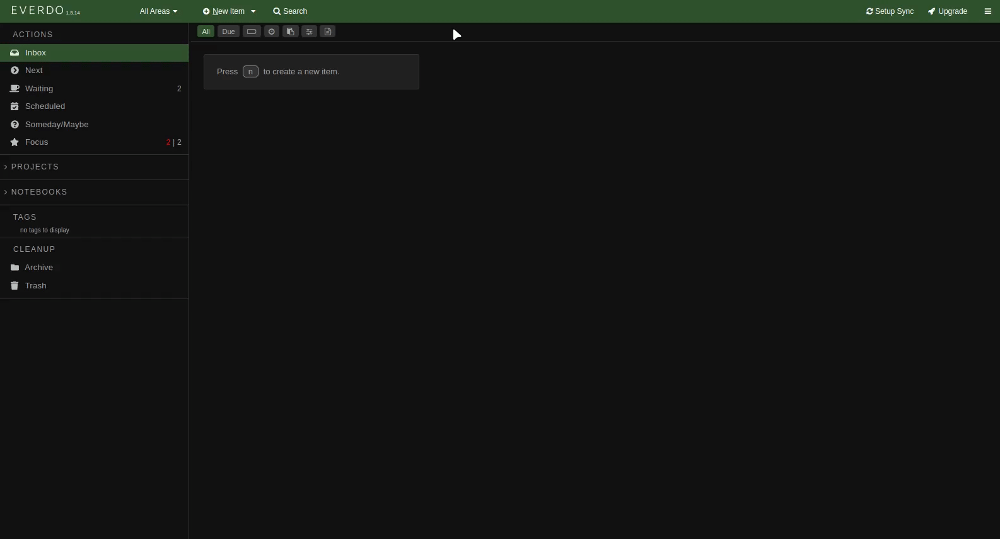
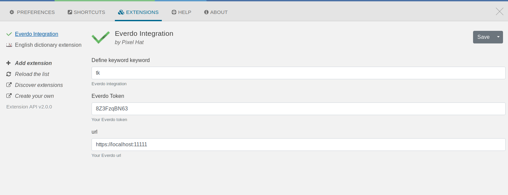

# ULauncher Everdo Integration

[Ulauncher](https://ulauncher.io/) extension for quick add new inbox tasks on [Everdo](https://everdo.net/).

# Configuration

First, you must configure Everdo.

1. Go to Settings->API and enable the API by checking a checkbox.
2. Specify the IP address or hostname of the computer. To be able to communicate with the API from the same computer, you can specify localhost as the hostname. If you want the API to be accessible on the network, specify the IP address on the local network. See determining the IP address.
3. In most cases, you will not need to change the default port value, but sometimes it's necessary in case of a conflict.

Once configured, press Apply and restart the app. Upon restart, you should see a notification saying Everdo API is up.

Second, you must provide your **token** and your **URL** to the plugin.

